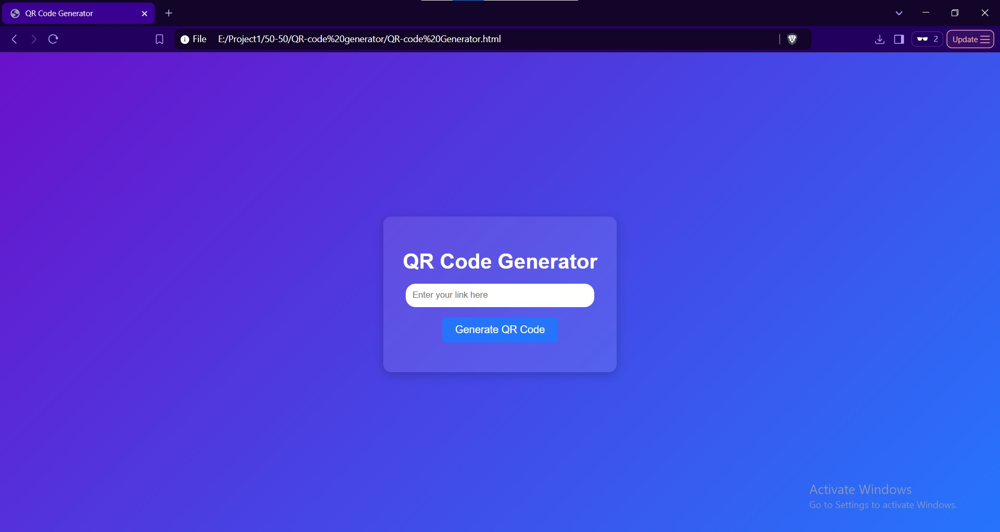

# QR Code Generator  

## Description  
This is a simple web-based **QR Code Generator** built using **HTML, CSS, and JavaScript**. It allows users to enter a URL or text and generate a **QR code** for it instantly.  

## Features  
✅ **User-friendly interface** with a clean, modern design  
✅ **Instant QR Code generation** for any text or link  
✅ **Responsive design** that works on all screen sizes  
✅ **Lightweight and fast** (uses the `qrcodejs` library)  

## Viewport of Webpage

## How to Use  
1. Open the `QR-code Generator.html` file in a web browser.  
2. Enter a URL or any text in the input field.  
3. Click the **"Generate QR Code"** button.  
4. A QR Code will be generated below the button.  
5. Scan the QR code using your phone to test it.  

## Installation & Usage  
No installation is required. Just download and open `QR-code Generator.html` in your browser.  

## Dependencies  
- **[QRCode.js](https://github.com/davidshimjs/qrcodejs)** (CDN is included in the `<script>` tag).  

## Future Improvements  
🚀 Add a **download QR code** feature    ~(done ✅)  
🚀 Allow users to **customize colors and sizes**  
🚀 Improve **error handling and validation**  

## License  
This project is open-source and free to use. 🚀 Enjoy coding!  

---
